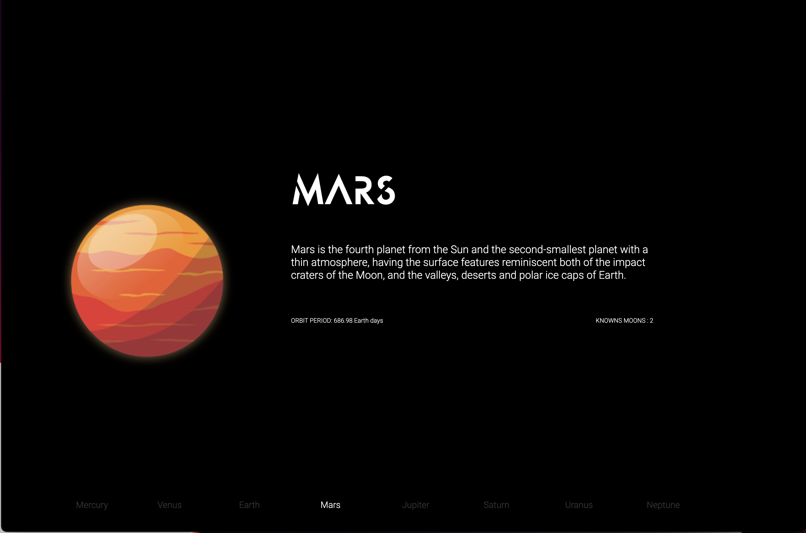

# Modern carousel template
## Width Swipper.js & anime.js

Make a modern and animated carousel with this template. (Responsive)

### Demo : 
- Clone the git repository with the command bellow :

```bash
mkdir Explore
cd Explore
git clone https://github.com/JulesEfrei/Explore.git
```
- Next, open the html file and enjoy it !

### Why does this files ?

- `index.html` : Core of the Web page
- `style.scss` : Style of the index.html (Using Sass)
- `style.css.map` : map of the css (Creating when scss file is compiled)
- `anime.min.js` : Import of anime.js library
- `main.js` : main JavaScript code
- `Font folder` : Import external font

### Why Javascript & Sass

I use Sass by default in all my front-end projects for these features. Of course, you can understand the whole project without having a knowledge of Sass (Sass is a css tool). Secondly, JavaScript is a staple for any modern and dynamic website for animations and flexibility with the DOM.

## Getting Started

### Download

Start by cloning the repository into your project :

```bash
cd "your_project"
mkdir template; cd template
git clone https://github.com/JulesEfrei/Explore.git
```

Now download the anime.js depencies

```bash
npm install anime.js --save
```

### File include

Link `anime.min.js` and the Swipper import in your `HTML` file :

```html
<script src="https://unpkg.com/swiper/swiper-bundle.js"></script>
<script src="./assets/js/anime.min.js"></script>
```

Then, create a `main.js` file in your project and include it in your `HTML` :

```bash
touch main.js
```

```html
<script src="./assets/js/main.js"></script>
```
# How to use & modify the template

As we have seen before, you can import external fonts. Just put your font in the right folder. Or you can import a Goggle font and link it to the `html` file. If you are not using Sass in your project, you can delete the `styles.scss` & `style.css.map` files and change the style in the regular `styles.css` file.

## Carousel with Swiper

As you can see in the `html` there is a `#slider` section. It corresponds to the carousel.

```html
<section id="slider">
        <!-- required div -->
        <div class="swiper-container">
            <div class="swiper-wrapper">
        <!-- 01 -->
                <div class="swiper-slide">
                    <div class="left mercure"></div>
                    <div class="planet_text_container">
                        <H1 class="title">MERCURY</H1>
                        <p class="resume">
                            Mercury is the closest planet to the Sun but, perhaps
                            surprisingly, it does not have the highest temperatures. It is
                            the second densest planet of the Solar System, but also the
                            smallest planet. The structure of Mercury makes it the most
                            similar planet to Earth.
                        </p>
                        <ul class="anim_text_list">
                            <li>ORBIT PERIOD: 87.97 Earth days</li>
                            <li>KNOWNS MOONS : None</li>
                        </ul>
                    </div>
                </div>
        <!-- 02 -->
                <div class="swiper-slide">
                    <div class="left venus"></div>
                    <div class="planet_text_container">
                        <H1 class="title">VENUS</H1>
                        <p class="resume">
                            Venus is the second planet from the Sun and the
                            sixth-largest. Together with Mercury, they are the only
                            planets without a satellite, even though Mercury is closer to
                            the sun, Venus is the hottest planet.
                        </p>
                        <ul class="anim_text_list">
                            <li>ORBIT PERIOD: 224.70 Earth days</li>
                            <li>KNOWNS MOONS : None</li>
                        </ul>
                    </div>
                </div>
        <!-- required div -->
            </div>
            <div class="swiper-pagination"></div>
        </div>
    </section>
```

There are a lot of informations here but you just need to remember that you should not remove the `swiper-container` div and those `swiper-slide` containers. Then, don't remove the `swiper-paganitaion` div. 
You can edit all the content inside the `.swipper-slide` container. Each of these conatiner is a slide. In this template, you already have an image on the left of the slide and on the right, a text / descrirption section.



NB : my `swpier-pagination` is empty. You will change the values directly in JavaScript but you can also add them in the html file if you prefer.

In the `main.js` file, there is a instance of Swiper. It takes as arguments the `.swiper-container` (I told you.. Don't delete this container) and an object with the options of your carousel.

```js
var slider = new Swiper('.swiper-container', {
    loop: true,
    spaceBetween: 200, 
    pagination:{
        el: ".swiper-pagination",
        clickable: true,
        renderBullet: function(index, className) {
            return '<div class="' + className + '">' + keys[index] + "</div>";
        }
    }
});
```

Here is the list the options :

- **loop** : *boolean*. Allow the loop in the carousel. When we slide on the last slide, the first slide follow.
- **spaceBetween** : *number*. Set the space between slide.
- **pagination** : *object*. Customize the control on our carousel.
    - **el** : *css class*. Set the pagination container.
    - **clickable** : *boolean*. If true, we can navigate with the pagination.
    - **renderBullet** : *function*. It take on arguments an index and a class name for the style in css. This function create all pagination items we need from the array `keys`

So, there is the `keys` array in `main.js` :

```js
var keys = [
    "Mercury",
    "Venus",
    "Earth",
    "Mars",
    "Jupiter",
    "Saturn",
    "Uranus",
    "Neptune"
  ];
```

Modify this array with your own pagination. You can also change the carousel options.
More information about Swiper in their [documentation](https://swiperjs.com/swiper-api)

## Add animation on the carousel with anime.js

In Swiper, there is a method called `slideChangeTransitionStart` that we use to set actions when changing slides. It is with this method that we add the animation. For animations, we use the `anime.js` library. It works very easy, here is its [documentation](https://animejs.com/documentation/). By default in this template, there are tiny animation of each slides elements when the slide changes and a looping animation of the image. You can change and/or remove all of them and create your own animations.

### How works anime.js

In our `main.js`, we simply use the anime function and define the animation with all properties as you can see in the doc.

```js
anime({
        targets: '.title', 
        translateX: [500, 0],
        opacity: [0, 1],
        easing: 'easeOutElastic(1, 10)',
        duration: 2000
    });
```

```diff
! The targets key is required. It takes on value the class (or id) of the element in HTML 
```
Then, there are other option for our animation. 
Here we have a translateX from x = 500 to x = 0,
an opacity from 0 to 1,
an easing and the duration of the animation.

So in the template, we finally have these animations :
```js
slider.on('slideChangeTransitionStart', function(){
    anime({
        targets: '.title', 
        translateX: [500, 0],
        opacity: [0, 1],
        easing: 'easeOutElastic(1, 10)',
        duration: 2000
    });
    anime({
        targets: '.resume', 
        translateX: [250, 0],
        opacity: [0, 1],
        delay: 300,
        easing: 'easeOutElastic(1, 10)',
        duration: 2000
    });
    anime({
        targets: '.anim_text_list', 
        translateY: [250, 0],
        opacity: [0, 1],
        easing: 'easeOutElastic(1, 10)',
        duration: 2000
    });
});
```


## Enjoy ✌🏻

I hope I help you as much as you want and this template help you to save your time. Now, you can use a modern carousel in your own website.

Thanks for reading !

Have fun & Code !
